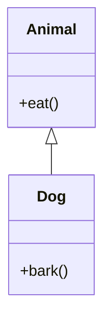

# 📘 Understanding Class Inheritance in C++
<!--TOC-->
  - [🧠 What is Inheritance?](#-what-is-inheritance)
    - [🔑 Key Benefits:](#-key-benefits)
  - [🧱 Basic Syntax](#-basic-syntax)
    - [🔓 Access Modifiers in Inheritance](#-access-modifiers-in-inheritance)
  - [🧪 Example: Basic Inheritance](#-example-basic-inheritance)
    - [🔍 Explanation:](#-explanation)
  - [🔄 Constructor Calls in Inheritance](#-constructor-calls-in-inheritance)
    - [🔍 How Constructors Work in Inheritance](#-how-constructors-work-in-inheritance)
    - [🧪 Example: Constructor Call Order](#-example-constructor-call-order)
    - [🧰 Using Initialization Lists in Derived Constructors](#-using-initialization-lists-in-derived-constructors)
    - [⚠️ Notes](#-notes)
  - [🧬 Types of Inheritance](#-types-of-inheritance)
  - [🧪 Example: Multilevel Inheritance](#-example-multilevel-inheritance)
  - [✅ Summary](#-summary)
  - [🎯 Quiz!](#-quiz)
<!--/TOC-->

## 🧠 What is Inheritance?

**Inheritance** is a fundamental concept in **Object-Oriented Programming (OOP)** that allows a class (called the **derived class** or **subclass**) to inherit attributes and behaviors (fields and methods) from another class (called the **base class** or **superclass**).

### 🔑 Key Benefits:
- **Code reuse**: Avoids duplication by reusing existing class functionality.
- **Extensibility**: Allows new functionality to be added with minimal changes.

---

## 🧱 Basic Syntax

```cpp
class Base {
  // base class members
};

class Derived : access_modifier Base {
  // derived class members
};
```

### 🔓 Access Modifiers in Inheritance

| Modifier     | Description |
|--------------|-------------|
| `public`     | Public and protected members of the base class retain their access levels in the derived class. |
| `protected`  | Public and protected members of the base class become protected in the derived class. |
| `private`    | Public and protected members of the base class become private in the derived class. |

```cpp
class A
{
public: 
	int x;

protected:
	int y;

private:
	int z;
};

class B : public A
{
	//x is public
	//y is protected
	//z is not accessible from B
};

class C : protected A
{
	//x is protected
	//y is protected
	//z is not accessible from C
};

class D : private A //private is the default
{
	//x is private
	//y is private
	//z is not accessible from D
};


```

---

## 🧪 Example: Basic Inheritance

```cpp
#include <iostream>
using namespace std;

class Animal {
  public:
    void eat() {
        cout << "This animal eats food." << endl;
    }
};

class Dog : public Animal {
  public:
    void bark() {
        cout << "The dog barks." << endl;
    }
};

int main() {
    Dog myDog;
    myDog.eat();   // Inherited from Animal
    myDog.bark();  // Defined in Dog

    return 0;
}
```

### Class Diagram



### 🔍 Explanation:
- `Dog` inherits from `Animal` using `public` inheritance.
- `Dog` can access `eat()` because it is a public member of `Animal`.

---

## 🔄 Constructor Calls in Inheritance

### 🔍 How Constructors Work in Inheritance

When a derived class object is created, **constructors are called in the order of inheritance hierarchy**:

1. **Base class constructor** is called first.
2. Then the **derived class constructor** is executed.

This ensures that the base part of the object is properly initialized before the derived part.

### 🧪 Example: Constructor Call Order

```cpp
#include <iostream>
using namespace std;

class Animal {
  public:
    Animal() {
        cout << "Animal constructor called." << endl;
    }
};

class Dog : public Animal {
  public:
    Dog() {
        cout << "Dog constructor called." << endl;
    }
};

int main() {
    Dog d;
    return 0;
}
```

**Output:**
```
Animal constructor called.
Dog constructor called.
```

---

### 🧰 Using Initialization Lists in Derived Constructors

You can explicitly call a base class constructor using an **initialization list** in the derived class:

```cpp
class Animal {
  public:
    Animal(string type) {
        cout << "Animal: " << type << endl;
    }
};

class Dog : public Animal {
  public:
    Dog() : Animal("Dog") {
        cout << "Dog constructor called." << endl;
    }
};
```

---

### ⚠️ Notes

- If the base class only has a **parameterized constructor**, the derived class **must** explicitly call it.
- If the base class has a **default constructor**, it is called automatically unless specified otherwise.


---

## 🧬 Types of Inheritance

| Type             | Description |
|------------------|-------------|
| **Single**       | One base class, one derived class |
| **Multiple**     | One derived class inherits from multiple base classes |
| **Multilevel**   | A class is derived from a derived class |
| **Hierarchical** | Multiple classes inherit from a single base class |
| **Hybrid**       | Combination of multiple types (can lead to ambiguity)

Here is an example of a multilevel inheritance structure.


---

## 🧪 Example: Multilevel Inheritance

```cpp
class Animal {
  public:
    void eat() { cout << "Eating..." << endl; }
};

class Mammal : public Animal {
  public:
    void walk() { cout << "Walking..." << endl; }
};

class Human : public Mammal {
  public:
    void speak() { cout << "Speaking..." << endl; }
};

int main() {
    Human h;
    h.eat();   // From Animal
    h.walk();  // From Mammal
    h.speak(); // From Human
    return 0;
}
```

---

## ✅ Summary

| Concept        | Description |
|----------------|-------------|
| Base Class     | The class being inherited from |
| Derived Class  | The class that inherits |
| Access Control | Determines visibility of inherited members |
| Code Reuse     | Inheritance promotes modular and reusable code |

---

## 🎯 Quiz!

Here's a short quiz on the topic: [quiz](./5_Inheritance_quiz.html)


## 🔭 Markdown Viewer

How to view the markdown files in a browser...
- [Markdown Viewer](../../Shared/0_Setup.md)

---

## 🧠 Lecture Practices

Here are the lecture Practices...
- [Day 7](./Day07.md)
- [Day 8](./Day08.md)
- [Day 9](./Day09.md)

---

## 🔍 Lecture Quizzes

Here are the lecture quizzes...
- [Day 7](https://forms.office.com/r/s02tg66qFm)
- [Day 8](https://forms.office.com/r/0bGwGBWENi)
- [Day 9](https://forms.office.com/r/BQFdNAsBB0)

---

## Weekly Topics
Here are the topics for the week...
- [Classes](./1_Classes.md)
- [Structs](./1_Structs.md)
- [Fields](./2_Fields.md)
- [Getters and Setters](./2_GettersSetters.md)
- [Constructors](./3_Constructors.md)
- [Instances](./4_Instances.md)
- [Inheritance](./5_Inheritance.md)
- [Polymorphism](./6_Polymorphism.md)
- [Pointers](./7_Pointers.md)
- [Upcasting](./7_Upcasting.md)
- [Misc. Concepts](./8_Misc.md)
- [4 Pillars of OOP](./1_FourPillars.md)

